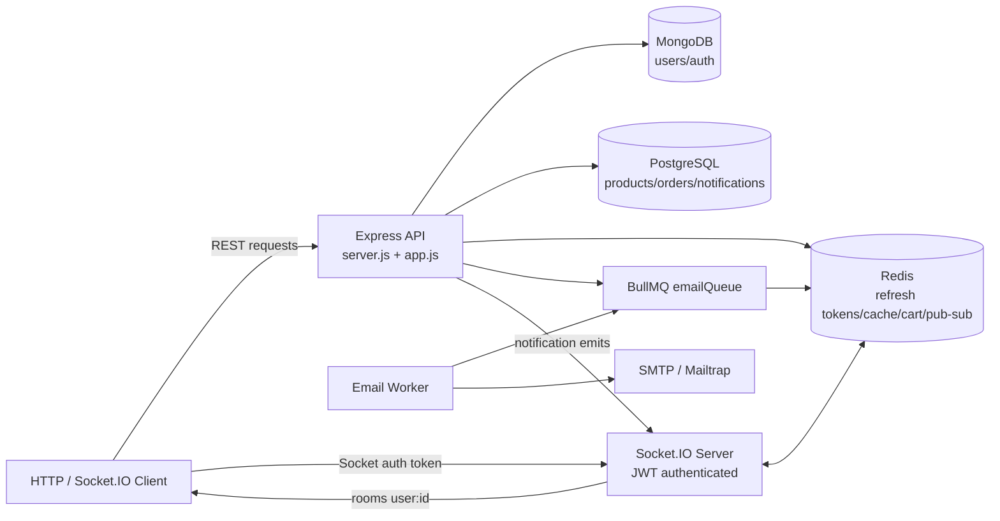

# Phase 2 E-Commerce Backend

A Node.js backend for an e-commerce workflow with authentication, product browsing, Redis-backed carts, transactional order checkout, email jobs, and real-time notifications. The service combines MongoDB for users/auth data, PostgreSQL for catalog/order/notification data, Redis for sessions/cache/cart/queues/socket pub-sub, and Socket.IO for live notification delivery.

## Feature List

- Email/password registration with email verification.
- JWT access tokens plus HttpOnly refresh-token cookies.
- Refresh-token rotation and logout invalidation through Redis.
- Google OAuth login and local-account linking.
- User profile endpoint protected by bearer auth.
- Product listing with category/search filters, pagination, and Redis caching.
- Admin-only product creation with product-cache invalidation.
- Redis cart with stock validation and 24-hour cart TTL.
- Order checkout from cart using PostgreSQL transactions and row locks.
- Order history and order detail APIs scoped to the authenticated user.
- BullMQ email queue for verification, password reset, and order confirmation emails.
- Internal notification creation endpoint protected by `x-internal-secret`.
- Real-time per-user notification delivery with Socket.IO and the Redis adapter.
- Multi-instance Docker Compose setup with two API instances for socket cross-talk testing.
- Jest and Supertest integration tests for auth, products, and orders.

## Tech Stack

- Runtime: Node.js, Express.js
- Auth: JWT, bcryptjs, Google OAuth client, cookie-parser
- Realtime: Socket.IO, `@socket.io/redis-adapter`
- Data stores: MongoDB with Mongoose, PostgreSQL with `pg`, Redis with ioredis/redis
- Queues and mail: BullMQ, Nodemailer, Mailtrap-compatible SMTP
- Tooling: Docker, Docker Compose, Nodemon, Jest, Supertest

## Architecture Diagram



## Environment Variables

Create `.env` from `.env.example` and add the newer PostgreSQL/internal-notification values if they are not present:

```bash
cp .env.example .env
```

| Variable | Purpose | Example |
| --- | --- | --- |
| `PORT` | API port | `3000` |
| `NODE_ENV` | Runtime mode | `development` |
| `APP_URL` | Base URL used in email links | `http://localhost:3000` |
| `MONGO_URI` | MongoDB connection string for users/auth | `mongodb://127.0.0.1:27017/Phase_2_project` |
| `REDIS_URL` | Redis URL for cache, cart, refresh tokens, BullMQ, socket adapter | `redis://127.0.0.1:6380` |
| `PG_HOST` | PostgreSQL host | `127.0.0.1` |
| `PG_PORT` | PostgreSQL port | `5432` locally, `5433` from Docker host |
| `PG_USER` | PostgreSQL user | `postgres` |
| `PG_PASSWORD` | PostgreSQL password | `postgrespassword` |
| `PG_DATABASE` | PostgreSQL database | `ecommerce_db` |
| `JWT_ACCESS_SECRET` | Secret for access tokens | `replace-with-long-random-secret` |
| `JWT_REFRESH_SECRET` | Reserved refresh secret setting | `replace-with-long-random-secret` |
| `ACCESS_TOKEN_EXPIRES_IN` | Access token lifetime | `15m` |
| `REFRESH_TOKEN_EXPIRES_IN` | Refresh-token lifetime setting | `7d` |
| `INTERNAL_SECRET` | Secret required by `/notifications/internal` | `replace-with-internal-secret` |
| `MAIL_HOST` | SMTP host | `sandbox.smtp.mailtrap.io` |
| `MAIL_PORT` | SMTP port | `2525` |
| `MAIL_USER` | SMTP username | `your_mailtrap_user` |
| `MAIL_PASS` | SMTP password | `your_mailtrap_password` |
| `MAIL_FROM` | From address for outgoing email | `"Auth System <no-reply@authsystem.com>"` |
| `GOOGLE_CLIENT_ID` | Google OAuth client ID | `your-client.apps.googleusercontent.com` |
| `GOOGLE_CLIENT_SECRET` | Google OAuth client secret | `your_google_client_secret` |
| `GOOGLE_CALLBACK_URL` | Google OAuth callback | `http://localhost:3000/auth/google/callback` |

For Docker Compose, the API services use internal service names such as `mongodb`, `postgres`, and `redis`. From the host machine, Redis is exposed on `6380` and PostgreSQL is exposed on `5433`.

## How To Run Locally

Install dependencies:

```bash
npm install
```

Start MongoDB, Redis, and PostgreSQL locally. A typical local `.env` looks like this:

```env
PORT=3000
NODE_ENV=development
APP_URL=http://localhost:3000
MONGO_URI=mongodb://127.0.0.1:27017/Phase_2_project
REDIS_URL=redis://127.0.0.1:6380
PG_HOST=127.0.0.1
PG_PORT=5432
PG_USER=postgres
PG_PASSWORD=postgrespassword
PG_DATABASE=ecommerce_db
JWT_ACCESS_SECRET=replace-with-long-random-secret
INTERNAL_SECRET=replace-with-internal-secret
```

Run the PostgreSQL migration and optional admin seed:

```bash
node scripts/migrate.js
node scripts/seedAdmin.js
```

Start the API:

```bash
npm run dev
```

In a second terminal, start the email worker:

```bash
npm run worker
```

The API runs at:

```text
http://localhost:3000
```

Socket test page:

```text
http://localhost:3000/test
```

## How To Run With Docker

Build and start MongoDB, PostgreSQL, Redis, two API instances, and the worker:

```bash
docker compose up --build -d
```

Run the PostgreSQL migration inside the API container:

```bash
docker compose exec api node scripts/migrate.js
```

Optional admin seed:

```bash
docker compose exec api node scripts/seedAdmin.js
```

Useful commands:

```bash
docker compose ps
docker compose logs -f api
docker compose logs -f api_2
docker compose logs -f worker
docker compose down
```

Exposed services:

| Service | Host URL / Port |
| --- | --- |
| API instance 1 | `http://localhost:3000` |
| API instance 2 | `http://localhost:3001` |
| MongoDB | `localhost:27017` |
| PostgreSQL | `localhost:5433` |
| Redis | `localhost:6380` |

## API Endpoints

Use `Authorization: Bearer <accessToken>` for protected user/admin routes. Refresh tokens are stored as HttpOnly cookies.

### Auth And User

| Method | Endpoint | Auth | Description |
| --- | --- | --- | --- |
| `POST` | `/auth/register` | No | Register user and queue verification email. Body: `email`, `password`. |
| `POST` | `/auth/login` | No | Login verified user, returns `accessToken`, sets `refreshToken` cookie. |
| `POST` | `/auth/refresh` | Cookie | Rotate refresh token and return a new access token. |
| `POST` | `/auth/logout` | Cookie | Delete refresh token from Redis and clear cookie. |
| `GET` | `/auth/verify/:token` | No | Verify email token. |
| `POST` | `/auth/forgot-password` | No | Queue password reset email if account exists. |
| `POST` | `/auth/reset-password` | No | Reset password. Body: `token`, `newPassword`. |
| `GET` | `/auth/google` | No | Start Google OAuth flow. |
| `GET` | `/auth/google/callback` | No | Handle Google callback and issue tokens. |
| `GET` | `/user/profile` | Bearer token | Return authenticated user profile. |

### Products And Admin

| Method | Endpoint | Auth | Description |
| --- | --- | --- | --- |
| `GET` | `/products` | No | List products with `category`, `search`, `page`, and `limit` query params. |
| `GET` | `/products/:id` | No | Get product details plus computed availability. |
| `POST` | `/admin/products` | Admin bearer token | Create product. Body: `name`, `price`, `stock`, `category`. |

### Cart

| Method | Endpoint | Auth | Description |
| --- | --- | --- | --- |
| `POST` | `/cart/add` | Bearer token | Add/update cart item. Body: `productId`, `quantity`. |
| `GET` | `/cart` | Bearer token | Return cart items with product details and subtotals. |
| `GET` | `/cart/total` | Bearer token | Return total cart value. |
| `DELETE` | `/cart/:productId` | Bearer token | Remove a product from the cart. |

### Orders

| Method | Endpoint | Auth | Description |
| --- | --- | --- | --- |
| `POST` | `/orders` | Bearer token | Create order from the Redis cart, decrement stock, clear cart, queue confirmation email. |
| `GET` | `/orders` | Bearer token | List authenticated user's orders with `page` and `limit`. |
| `GET` | `/orders/:id` | Bearer token | Get one authenticated user's order with items. |

### Notifications

| Method | Endpoint | Auth | Description |
| --- | --- | --- | --- |
| `POST` | `/notifications/internal` | `x-internal-secret` | Create notification for a user and emit `notification:new`. |
| `GET` | `/notifications` | Bearer token | List user notifications with unread count and pagination. |
| `PATCH` | `/notifications/:id/read` | Bearer token | Mark one notification as read and emit `notification:read`. |
| `PATCH` | `/notifications/read-all` | Bearer token | Mark all user notifications as read and emit `notifications:read-all`. |

Internal notification body:

```json
{
  "user_id": "mongo-user-id-string",
  "type": "order",
  "title": "Order placed",
  "body": "Your order was placed successfully."
}
```

## Socket Events

Socket.IO is initialized in `server.js` through `socket/socket.js`. Clients must provide a valid JWT access token by one of these methods:

- `auth: { token: "<accessToken>" }`
- `Authorization: Bearer <accessToken>` header
- `?token=<accessToken>` query string

On connection, the server verifies the token and joins the socket to:

```text
user:<userId>
```

Server-emitted events:

| Event | Payload | When |
| --- | --- | --- |
| `notification:new` | Saved notification row | After `POST /notifications/internal`. |
| `notification:read` | `{ "id": notificationId }` | After `PATCH /notifications/:id/read`. |
| `notifications:read-all` | `{ "updatedCount": number }` | After `PATCH /notifications/read-all`. |

Connection errors are returned as Socket.IO auth errors when the token is missing, invalid, expired, or lacks a user identifier.

## Testing Steps

Run automated tests:

```bash
npm test
```

The current test suite covers:

- Auth registration, login, refresh/logout, password reset, and mocked Google OAuth.
- Product Redis cache population and invalidation.
- Admin product creation authorization.
- Order checkout success, insufficient stock rollback, and concurrent last-item purchase behavior.

Manual testing helpers are available in:

- `API_Testing/auth.http`
- `API_Testing/product.http`
- `API_Testing/cart.http`
- `API_Testing/order.http`
- `API_Testing/notification.http`

Suggested manual flow:

1. Register and verify a user, then login to get an access token.
2. Seed or create products as admin.
3. Browse `/products`, add items with `/cart/add`, and inspect `/cart/total`.
4. Place an order with `POST /orders` and confirm the cart is cleared.
5. Connect a Socket.IO client with the access token.
6. Call `POST /notifications/internal` with `x-internal-secret` and verify the client receives `notification:new`.

## Known Limitations

- `scripts/migrate.js` currently creates `products`, `orders`, and `order_items`, but the notification repository expects a `notifications` table. Add that table before using notification APIs in a fresh PostgreSQL database.
- `.env.example` does not yet include every variable used by the newer e-commerce and notification code, especially PostgreSQL and `INTERNAL_SECRET`.
- Product and order data live in PostgreSQL while user/auth data live in MongoDB, so cross-store consistency is handled at the application level.
- Cart data is stored in Redis and expires after 24 hours from the latest cart write.
- Product cache invalidation uses Redis key scanning for `products:*`, which is acceptable for this learning/demo scale but should be replaced for high-volume production workloads.
- The internal notification endpoint trusts a shared secret header; production deployments should rotate and store that secret securely.
- Docker Compose starts two API instances for socket testing, but there is no load balancer in front of them.
- Email delivery depends on valid SMTP/Mailtrap credentials.

## License

ISC
